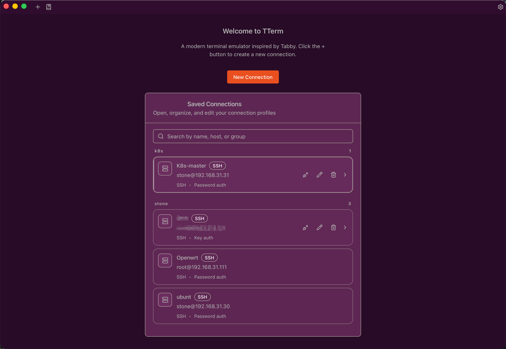
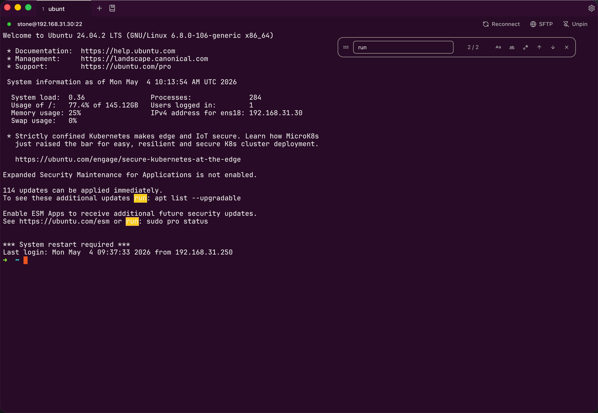
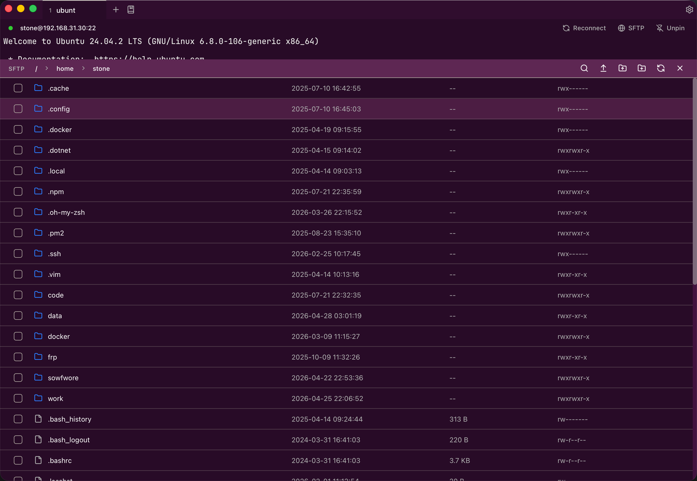
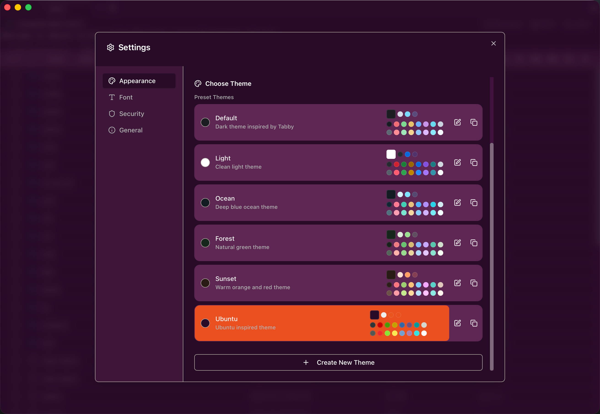

# tTerm — A Modern SSH Terminal with Built-in SFTP

English | [简体中文](./README.zh-CN.md)

`tTerm` is a desktop terminal app for developers, operators, and anyone who works with remote servers. It brings **local terminals, SSH sessions, SFTP file management, transfer progress tracking, session restore, and secure password storage** into one lightweight application.

If you often connect to servers, move files between local and remote machines, or juggle multiple terminal sessions, tTerm is designed to be the tool you can open and start working with immediately.



## Why tTerm?

- **Terminal and file management in one place**: Open the SFTP drawer from an SSH session and browse, upload, download, rename, or delete remote files without switching apps.
- **Built for multitasking**: Use multiple tabs, reorder them with drag and drop, and restore previous sessions after restarting the app.
- **Visible transfer progress**: Uploads, downloads, and batch operations expose clear task status and progress feedback.
- **Safer SSH workflow**: Confirm host keys, save reusable connection profiles, and store sensitive credentials with system keyring or an encrypted local vault.
- **Modern desktop experience**: Built with Tauri for a lightweight, fast, cross-platform app with themes, font settings, and internationalization.

## Key Features

### Terminal Experience



- Local shell terminal with configurable shell (auto-detect, or choose from system shells)
- Terminal search with real-time highlighting
- Multi-tab session management with duplicate, rename, close-others, and close-to-right
- Drag-and-drop tab reordering
- Responsive terminal resizing
- Web link detection
- Session restore after app restart

### SSH Connection Management

- Remote SSH terminal sessions
- Password or private-key authentication
- Saved and reusable connection profiles
- Connection testing
- SSH host key confirmation
- Known-host management
- Per-tab connection info bar with pinning

### Built-in SFTP File Manager



- Browse remote directories
- Create folders
- Rename files and directories
- Delete files and directories
- Batch delete with preview before confirmation
- Upload and download files
- Drag-and-drop upload for local files and folders
- Transfer cancellation and status tracking
- Clipboard support for file path copying

### Transfer Manager

- View upload and download tasks
- Expand batch transfer groups
- Track progress, speed, and status
- Clear completed tasks

### Personalization and Usability



- Built-in themes
- Custom theme editor with live preview
- Terminal palette preview with 16-color swatches
- Font settings with system font picker
- Cursor style picker
- English and Chinese UI with auto language detection
- Windows, macOS, and Linux desktop support
- Automatic config migration between versions

### Security

- System keyring integration
- Optional encrypted password vault
- Legacy SSH password data migration
- Local-first sensitive data storage

## Getting Started

### Download

Pre-built binaries are available on the [Releases](https://github.com/330079598/tTerm/releases) page for:

- **macOS** — Apple Silicon (aarch64) and Intel (x86_64) `.dmg`
- **Windows** — `.msi` installer
- **Linux** — `.AppImage` and `.deb` packages

### Prerequisites

- Node.js 18+
- pnpm
- Rust 1.70+
- Tauri 2 system dependencies

Platform-specific requirements:

- **Windows**: Microsoft C++ Build Tools
- **macOS**: Xcode Command Line Tools
- **Linux**: Tauri dependencies such as WebKitGTK, OpenSSL, and AppIndicator packages

### Install Dependencies

```bash
pnpm install
```

### Run in Development Mode

```bash
pnpm tauri dev
```

### Build the Desktop App

```bash
pnpm tauri build
```

Tauri writes platform-specific bundles under `src-tauri/target`.

### CI/CD

GitHub Actions workflows are included for automated builds:

- **release-main.yml** — Triggered on push to `main` or `v*` tags. Builds for macOS (aarch64 + x86_64), Ubuntu 24.04, and Windows. Creates draft GitHub releases.
- **release-dev-beta.yml** — Dev/beta release workflow.

## Common Scripts

```bash
# Start the frontend dev server
pnpm dev

# Build frontend assets
pnpm build

# Preview the frontend build
pnpm preview

# Start Tauri development mode
pnpm tauri dev

# Build the desktop application
pnpm tauri build

# Run ESLint
pnpm lint

# Fix ESLint issues automatically
pnpm lint:fix

# Format source files
pnpm format

# Check formatting
pnpm format:check
```

## Tech Stack

### Frontend

- React 18
- TypeScript
- Vite
- TanStack Router
- xterm.js
- i18next / react-i18next
- Radix UI Toast
- lucide-react
- Tailwind CSS 4

### Desktop and Backend

- Tauri 2
- Rust 2021
- portable-pty
- russh
- russh-sftp
- Tokio
- keyring
- aes-gcm / argon2 / zeroize

## Project Structure

```text
.
├── src/                 # React frontend application
│   ├── components/      # Terminal, SFTP, settings, theme, and UI components
│   ├── contexts/        # Global config, theme, and transfer state
│   ├── hooks/           # Tabs, connections, session restore, and feature hooks
│   ├── i18n/            # English and Chinese locale resources
│   ├── lib/             # Theme, startup, and utility helpers
│   ├── routes/          # TanStack Router pages
│   └── types/           # Frontend type definitions
├── src-tauri/           # Tauri / Rust backend
│   ├── src/config/      # App configuration and paths
│   ├── src/core/        # PTY, commands, and app state
│   ├── src/fonts/       # System font support
│   ├── src/profiles/    # Connection profile management
│   ├── src/session/     # Session persistence
│   ├── src/sftp/        # SFTP connections, file operations, and transfers
│   ├── src/ssh/         # SSH client, host keys, and credential storage
│   └── src/terminal/    # Terminal types and interactions
├── public/              # Static assets
└── dist/                # Frontend build output
```

## Use Cases

- Maintain several servers and switch between SSH sessions quickly
- Upload and download files between local and remote machines often
- Work with terminals and remote files in a single desktop window
- Save frequently used connection profiles while keeping credentials local and secure
- Use a lighter, modern, themeable alternative to heavier terminal clients

## Development Notes

tTerm's frontend calls Rust backend commands through Tauri `invoke`. Terminal support is powered by `portable-pty`, SSH and SFTP are powered by `russh` and `russh-sftp`, and sensitive data is handled through the system keyring or a local encrypted vault.

When developing, pay special attention to:

- Whether frontend interactions work well for multi-tab and multi-task workflows
- Whether Rust commands return clear errors that can be shown in the UI
- Whether file transfers expose complete progress, cancellation, and failure states
- Whether password, key, and host-fingerprint flows remain local, safe, and explicit
- Whether config migration between versions handles all data types (profiles, sessions, known hosts, passwords, SFTP stores)

## Contributing

Issues and pull requests are welcome. Before submitting changes, run:

```bash
pnpm lint
pnpm format:check
pnpm build
```

If your changes touch the Rust/Tauri backend, also run:

```bash
cargo check --manifest-path src-tauri/Cargo.toml
```

## License

MIT
