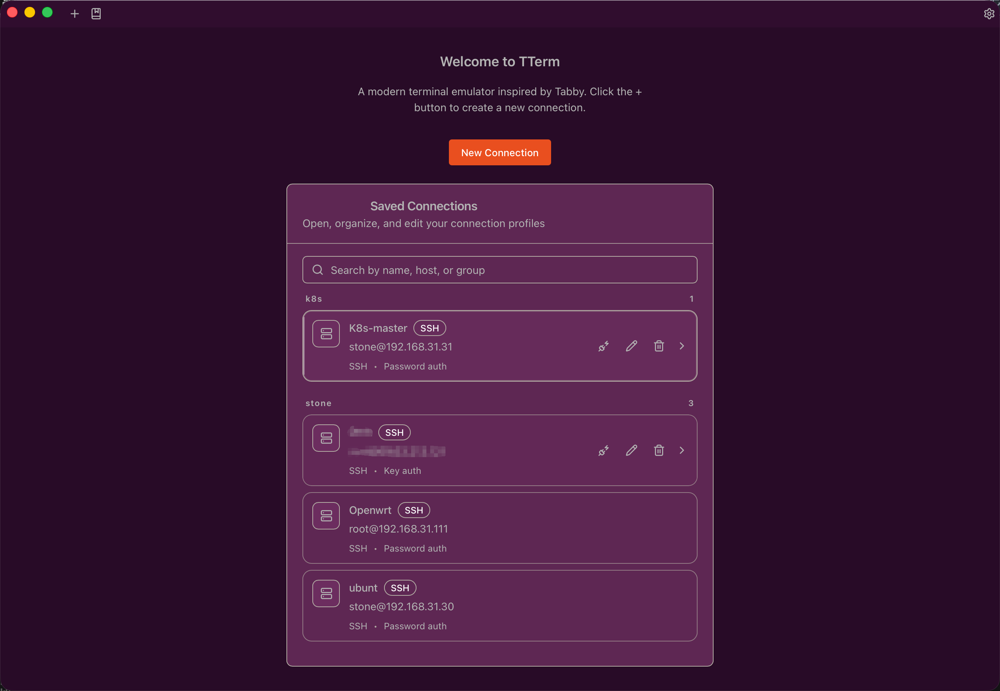
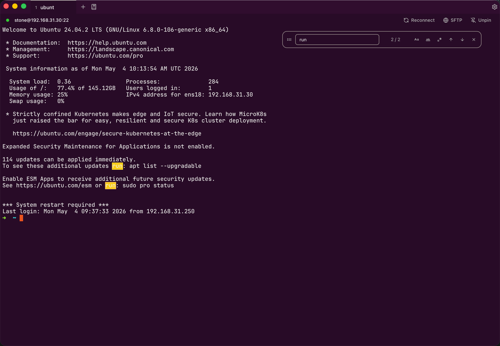
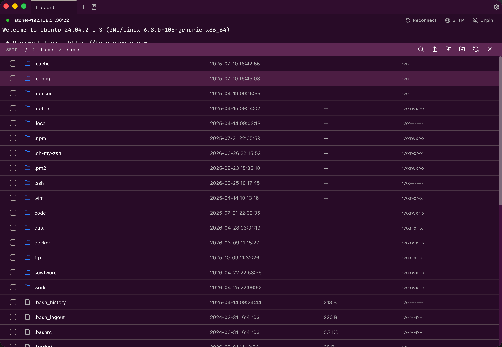
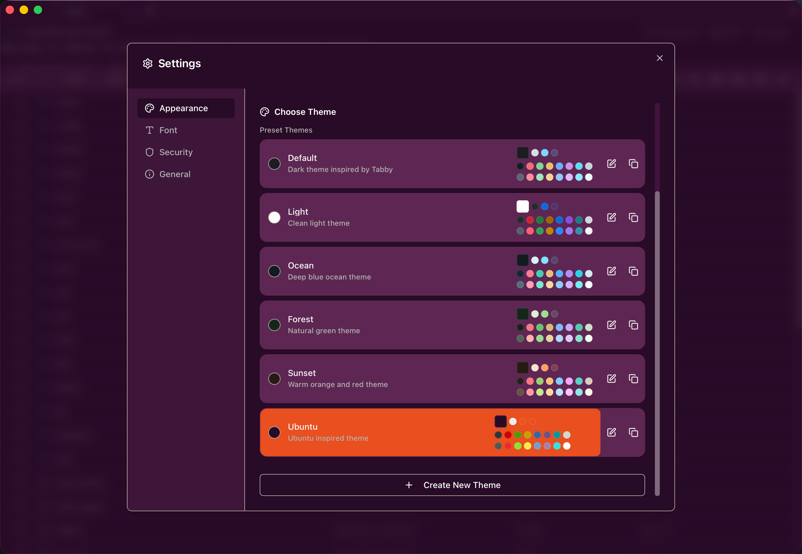

# tTerm — A Modern SSH Terminal with Built-in SFTP

English | [简体中文](./README.zh-CN.md)

`tTerm` is a desktop terminal app for developers, operators, and anyone who works with remote servers. It brings **local terminals, SSH sessions, SFTP file management, transfer progress tracking, session restore, and secure password storage** into one lightweight application.

If you often connect to servers, move files between local and remote machines, or juggle multiple terminal sessions, tTerm is designed to be the tool you can open and start working with immediately.



## Why tTerm?

- **Terminal and file management in one place**: Open the SFTP drawer from an SSH session and browse, upload, download, rename, or delete remote files without switching apps.
- **Built for multitasking**: Use multiple tabs, reorder them with drag and drop, and restore previous sessions after restarting the app.
- **ZMODEM (rz/sz) transfers**: On devices or jump hosts without SFTP, run `rz`/`sz` right in the terminal. Transfers are auto-detected, the same way SecureCRT/Xshell work.
- **Visible transfer progress**: Uploads, downloads, and batch operations expose clear task status and progress feedback.
- **Visual port forwarding**: Manage local, remote, and dynamic (SOCKS5) SSH tunnels from a dedicated page, with live status, traffic counters, and automatic reconnects.
- **Safer SSH workflow**: Confirm host keys, save reusable connection profiles, and store sensitive credentials with system keyring or an encrypted local vault.
- **Modern desktop experience**: Built with Tauri for a lightweight, fast, cross-platform app with themes, font settings, and internationalization.

## Key Features

### Terminal Experience



- Local shell terminal with configurable shell (auto-detect, or choose from system shells)
- Terminal search with real-time highlighting
- Multi-tab session management with duplicate, rename, close-others, and close-to-right
- Drag-and-drop tab reordering
- Responsive terminal resizing
- Web link detection
- Session restore after app restart

### SSH Connection Management

- Remote SSH terminal sessions
- Password or private-key authentication
- Saved and reusable connection profiles
- Connection testing
- SSH host key confirmation
- Known-host management
- Per-tab connection info bar with pinning

### Built-in SFTP File Manager



- Browse remote directories
- Create folders
- Rename files and directories
- Delete files and directories
- Batch delete with preview before confirmation
- Upload and download files
- Drag-and-drop upload for local files and folders
- Transfer cancellation and status tracking
- Clipboard support for file path copying

### ZMODEM File Transfer (rz / sz)

When SFTP isn't available (network-equipment consoles, serial/embedded targets, bastion hosts that only expose an interactive shell), you can move files right inside the terminal with `rz` / `sz`, just like SecureCRT / Xshell. It works in both local terminals and SSH sessions with no extra setup.

> The remote side needs `lrzsz` installed (e.g. `apt install lrzsz`, `yum install lrzsz`; for local terminals on macOS, `brew install lrzsz`).

**Download (remote → local)**

```bash
sz file.tar.gz            # one file
sz a.log b.log c.log      # several files, transferred in sequence
```

tTerm detects the transfer and starts receiving immediately, with no dialog. Files are saved to the ZMODEM download directory (the system Downloads folder by default). Existing files are never overwritten; a name clash becomes `file (1).tar.gz`.

**Upload (local → remote)**

```bash
rz
```

When tTerm sees `rz` start, it opens a file picker (multi-select). The chosen files are uploaded into the remote working directory. Cancelling the picker tells the remote `rz` to exit cleanly.

**Progress and cancellation**

- Progress, speed, and results appear in the Transfer Manager, alongside SFTP tasks.
- To cancel, click cancel in the Transfer Manager or press `Ctrl+C` in the terminal. Both send the standard abort sequence, so the remote `rz`/`sz` exits right away instead of timing out.
- While a transfer is running, keystrokes other than `Ctrl+C` are held back so they can't corrupt the data stream.
- If an SSH session reconnects, any unfinished transfer is cleaned up, since the remote process ended with the old connection.

**Settings and manual trigger**

- **Settings → General → ZMODEM**:
  - **Auto-detect ZMODEM transfers** (on by default): when off, tTerm stops scanning terminal output for rz/sz trigger sequences.
  - **Download directory**: where received files are saved. Leave empty to use the system Downloads folder.
- **Manual trigger**: if auto-detect is off or doesn't fire, choose **"Send files with ZMODEM (rz)"** or **"Receive files with ZMODEM (sz)"** from the terminal context menu, then run `rz` or `sz <file>`. You can also bind shortcuts to both actions under **Settings → Keyboard shortcuts → ZMODEM** (unbound by default). A manual trigger applies only to the next transfer in the current tab.

**SFTP or ZMODEM?**

They don't conflict, and there's no choice to make at connect time. SFTP runs on its own SSH subchannel and is better for browsing and for bulk or large transfers. ZMODEM rides the terminal stream itself, so it works where there's no SFTP subsystem, through multi-hop jumps, `su`, or `docker exec`, or when you just want to grab one file from the shell's current directory. Prefer SFTP when the server supports it.

### Transfer Manager

- View upload and download tasks
- Expand batch transfer groups
- Track progress, speed, and status
- Clear completed tasks

### Personalization and Usability



- Built-in themes
- Custom theme editor with live preview
- Terminal palette preview with 16-color swatches
- Font settings with system font picker
- Cursor style picker
- English and Chinese UI with auto language detection
- Windows, macOS, and Linux desktop support
- Automatic config migration between versions

### Security

- System keyring integration
- Optional encrypted password vault
- Legacy SSH password data migration
- Local-first sensitive data storage

## Getting Started

### Download

Pre-built binaries are available on the [Releases](https://github.com/330079598/tTerm/releases) page for:

- **macOS** — Apple Silicon (aarch64) and Intel (x86_64) `.dmg` and `.app` bundles
- **Windows** — `.exe` NSIS installer
- **Linux** — `.AppImage`, `.deb`, and `.rpm` packages

### Prerequisites

- Node.js 18+
- pnpm
- Rust 1.70+
- Tauri 2 system dependencies

Platform-specific requirements:

- **Windows**: Microsoft C++ Build Tools
- **macOS**: Xcode Command Line Tools
- **Linux**: Tauri dependencies such as WebKitGTK, OpenSSL, and AppIndicator packages

### Install Dependencies

```bash
pnpm install
```

### Run in Development Mode

```bash
pnpm tauri dev
```

On Linux, if the Wayland backend exits with a GDK protocol error or WebKitGTK
reports GBM buffer errors, use the XWayland-compatible development command:

```bash
pnpm tauri:dev:linux
```

This command runs the app with `GDK_BACKEND=x11` and disables WebKitGTK's
DMABUF renderer. An XWayland installation is required.

### Build the Desktop App

```bash
pnpm tauri build
```

Tauri writes platform-specific bundles under `src-tauri/target`.

### CI/CD

GitHub Actions workflows are included for automated builds:

- **release-main.yml** — Triggered on push to `main` or `v*` tags. Builds for macOS (aarch64 + x86_64), Ubuntu 24.04, and Windows. Creates draft GitHub releases.
- **release-dev-beta.yml** — Dev/beta release workflow.

## Common Scripts

```bash
# Start the frontend dev server
pnpm dev

# Build frontend assets
pnpm build

# Preview the frontend build
pnpm preview

# Start Tauri development mode
pnpm tauri dev

# Start Tauri on Linux through XWayland (Wayland/GBM compatibility mode)
pnpm tauri:dev:linux

# Build the desktop application
pnpm tauri build

# Run ESLint
pnpm lint

# Fix ESLint issues automatically
pnpm lint:fix

# Format source files
pnpm format

# Check formatting
pnpm format:check
```

## Tech Stack

### Frontend

- React 18
- TypeScript
- Vite
- TanStack Router
- xterm.js
- i18next / react-i18next
- Radix UI Toast
- lucide-react
- Tailwind CSS 4

### Desktop and Backend

- Tauri 2
- Rust 2021
- portable-pty
- russh
- russh-sftp
- Tokio
- keyring
- aes-gcm / argon2 / zeroize

## Project Structure

```text
.
├── src/                 # React frontend application
│   ├── components/      # Terminal, SFTP, settings, theme, and UI components
│   ├── contexts/        # Global config, theme, and transfer state
│   ├── hooks/           # Tabs, connections, session restore, and feature hooks
│   ├── i18n/            # English and Chinese locale resources
│   ├── lib/             # Theme, startup, and utility helpers
│   ├── routes/          # TanStack Router pages
│   └── types/           # Frontend type definitions
├── src-tauri/           # Tauri / Rust backend
│   ├── src/config/      # App configuration and paths
│   ├── src/core/        # PTY, commands, and app state
│   ├── src/fonts/       # System font support
│   ├── src/profiles/    # Connection profile management
│   ├── src/session/     # Session persistence
│   ├── src/sftp/        # SFTP connections, file operations, and transfers
│   ├── src/ssh/         # SSH client, host keys, and credential storage
│   ├── src/terminal/    # Terminal types and interactions
│   └── src/zmodem/      # ZMODEM (rz/sz) protocol engine, trigger detection, send/receive
├── public/              # Static assets
└── dist/                # Frontend build output
```

## Use Cases

- Maintain several servers and switch between SSH sessions quickly
- Upload and download files between local and remote machines often
- Work with terminals and remote files in a single desktop window
- Move files with `rz`/`sz` on network gear, embedded devices, or shell-only bastion hosts
- Save frequently used connection profiles while keeping credentials local and secure
- Use a lighter, modern, themeable alternative to heavier terminal clients

## Development Notes

tTerm's frontend calls Rust backend commands through Tauri `invoke`. Terminal support is powered by `portable-pty`, SSH and SFTP are powered by `russh` and `russh-sftp`, and sensitive data is handled through the system keyring or a local encrypted vault.

When developing, pay special attention to:

- Whether frontend interactions work well for multi-tab and multi-task workflows
- Whether Rust commands return clear errors that can be shown in the UI
- Whether file transfers expose complete progress, cancellation, and failure states
- Whether password, key, and host-fingerprint flows remain local, safe, and explicit
- Whether config migration between versions handles all data types (profiles, sessions, known hosts, passwords, SFTP stores)

### ZMODEM Implementation

The ZMODEM protocol lives entirely in the Rust backend (`src-tauri/src/zmodem/`). The frontend only handles settings, file picking, and progress display.

- **Custom push-based engine**: the existing `zmodem` crate isn't used (it does blocking synchronous I/O, supports a single file only, and is unmaintained). `protocol/engine.rs` is a pure state machine, `feed(bytes) -> { outgoing, actions, passthrough }`, that owns no I/O handle. That's required because `portable-pty` allows `take_writer()` only once, so each caller (the local PTY reader thread or the SSH reader task) writes `outgoing` back through the handle it already holds.
- **Protocol coverage**: CRC16 and CRC32 (CRC32 when sending), ZDLE escaping, hex and binary headers, `ZRPOS` resends, and multi-file batch receive. All wire formats were checked against real `lrzsz` captures.
- **Trigger detection**: `detect.rs` scans terminal output for `**\x18B00` (remote ran `sz`, so we receive) and `**\x18B01` (remote ran `rz`, so we send). It keeps a small carry buffer so a trigger split across two reads is still caught.
- **Data path**: the local PTY and SSH byte pipelines are already binary-safe, so ZMODEM data never goes through UTF-8 conversion. Once a transfer starts, terminal output goes to the engine instead of xterm. Leftover bytes after the transfer (such as the next shell prompt) still reach xterm.
- **Receive**: handled inline on the reader thread or task. Files go to the download directory, and filenames are sanitized to block path traversal.
- **Send**: runs on a dedicated OS thread (`send.rs`), because the sender has to stream chunks without waiting for a per-chunk ack.
  - The reader forwards peer bytes to that thread over `std::sync::mpsc`. When the thread finishes, the channel closes and the reader goes back to normal handling.
  - During local PTY sends, the terminal is switched to raw mode (`cfmakeraw`) so echo and XON/XOFF flow control can't corrupt binary frames.
  - As a fallback, the `ZFILE` header is resent on `ZNAK` or a repeated `ZRINIT`. Over SSH this is the only protection, since the remote terminal mode is outside our control.
- **State**: per-tab state lives in `ZmodemMap`, `ZmodemArmedSendMap`, and `ZmodemManualDetectMap` (`core/state.rs`), guarded by `session_nonce` so a stale session can't reuse it. These maps are touched from both OS threads and async tasks, so they use `std::sync` locks, not tokio locks' `blocking_*` methods.
- **Frontend**: `useZmodemTransfers.ts` listens for the `zmodem-send-requested-{tabId}` and `zmodem-transfer-start/progress/complete-{tabId}` events and feeds the existing Transfer Manager. `TransferTask.cancel` lets ZMODEM tasks use their own cancel path.

Besides unit tests, there are 8 integration tests that need real tools (`#[ignore]` by default). They run real `sz`/`rz` over plain pipes, a local PTY, and a throwaway userspace `sshd`, covering both upload and download:

```bash
brew install lrzsz   # or your platform's lrzsz package
cd src-tauri && cargo test --lib zmodem::real -- --ignored --test-threads=1
```

## Contributing

Issues and pull requests are welcome. Before submitting changes, run:

```bash
pnpm lint
pnpm format:check
pnpm build
```

If your changes touch the Rust/Tauri backend, also run:

```bash
cargo check --manifest-path src-tauri/Cargo.toml
```

## License

MIT
