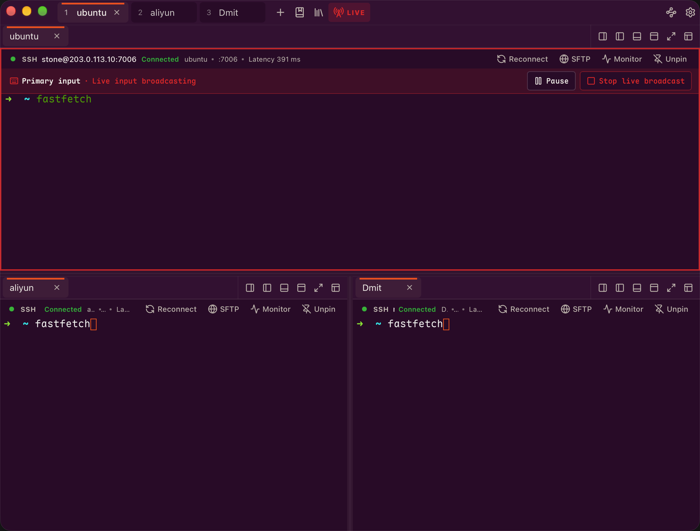
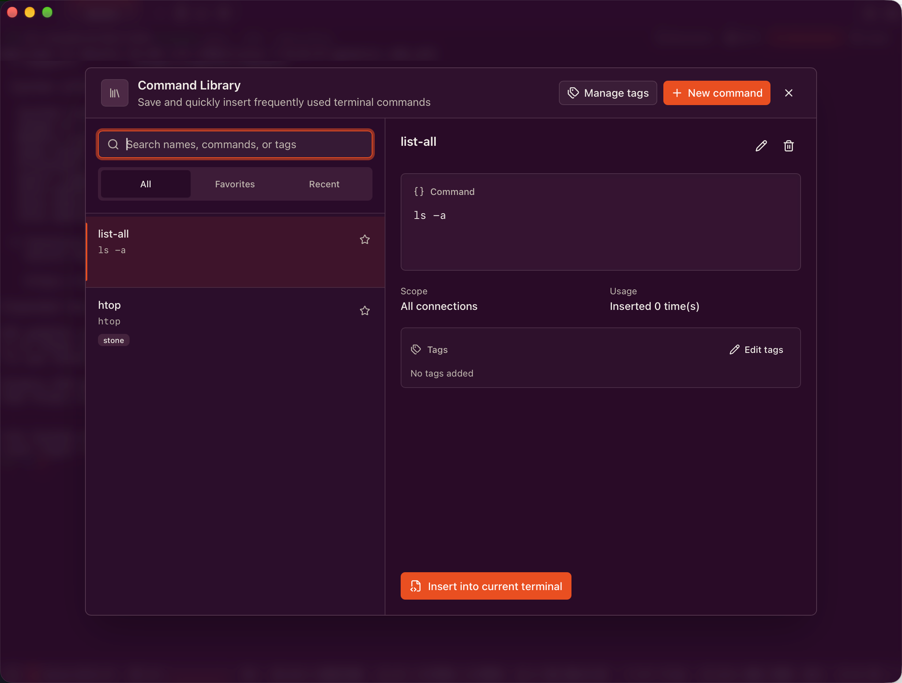
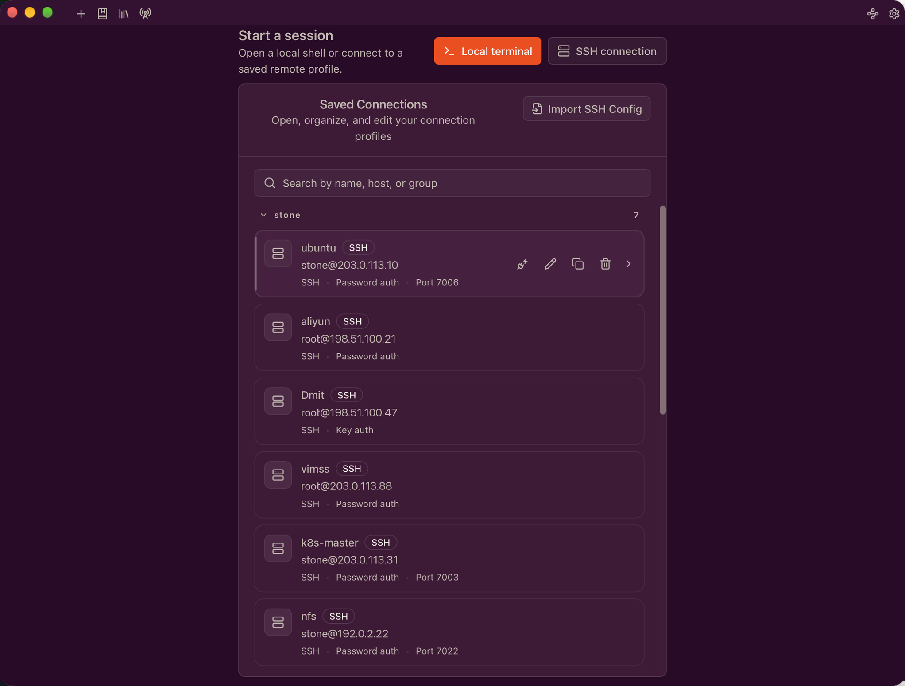
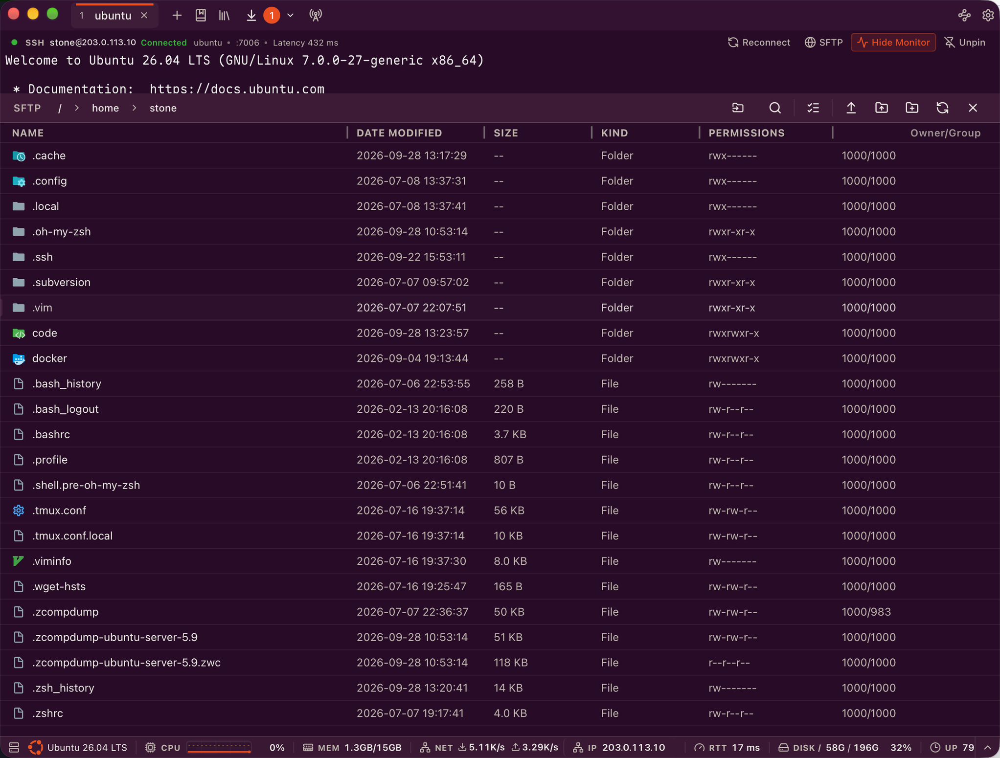
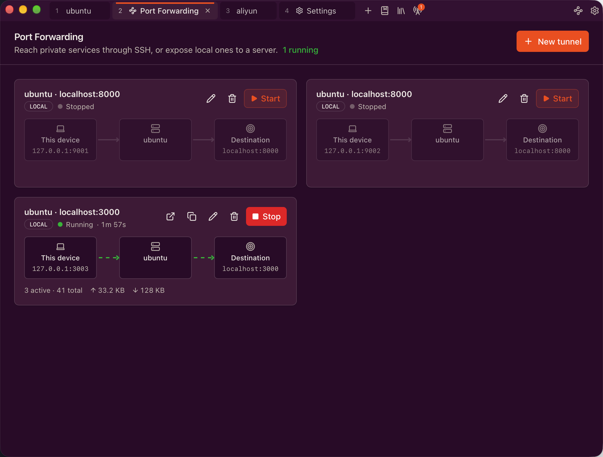
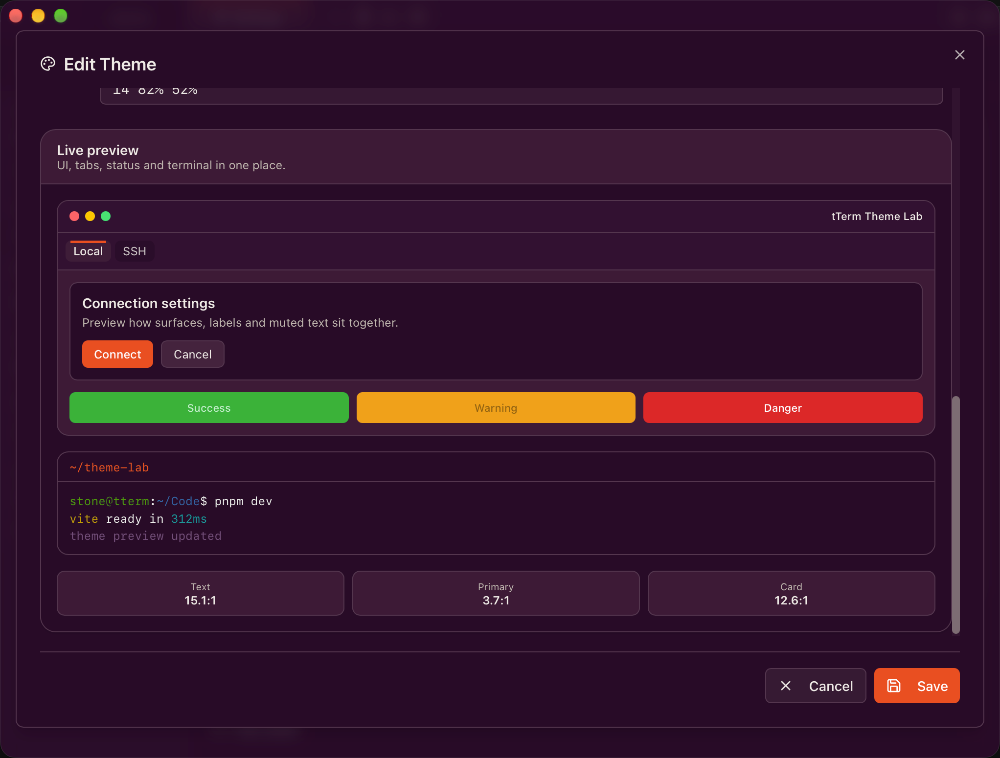

# tTerm — 现代化 SSH 终端与 SFTP 文件管理器

[English](./README.md) | 简体中文

`tTerm` 是一个面向开发者、运维和日常服务器使用者的桌面终端工具。它把 **本地终端、SSH 远程连接、分屏工作区、SFTP 文件管理、端口转发、服务器监控和加密凭据存储** 放在同一个轻量应用里，让你不用在终端、文件传输工具和连接管理器之间来回切换。

如果你经常连接服务器、上传下载文件、同时管理很多终端会话，tTerm 想成为那个“打开就能干活”的工具。



## 为什么选择 tTerm？

- **终端和文件管理一体化**：SSH 连接后即可打开 SFTP 面板，浏览、传输、在线编辑远程文件。
- **为多服务器场景而生**：工作区可任意分屏，一条命令可同时广播到多个终端，常用命令收进可搜索的命令库。
- **快速、可续传的文件传输**：SFTP 多通道并行、断点续传、冲突处理、限速；没有 SFTP 的主机可以用 ZMODEM（`rz`/`sz`）。
- **可视化端口转发**：在独立页面管理本地、远程、动态（SOCKS5）SSH 隧道，实时查看状态与流量，断线自动重连。
- **服务器状态一目了然**：每个 SSH 会话下方的监控栏显示 CPU、内存、网络、磁盘和延迟，服务器端无需安装任何东西。
- **更安全的连接体验**：主机密钥确认、SSH Agent 与跳板机支持，保存的密码在本地用 AES-256-GCM 加密。
- **更现代的桌面体验**：基于 Tauri 构建，体积轻、启动快，支持主题、自定义快捷键和中英文界面。

## 核心功能

### 工作区与标签

- 多标签会话，支持拖拽排序、复制、重命名、关闭其他 / 左侧 / 右侧标签
- 分屏：任意标签可向左、右、上、下分屏，标签可在分组间拖动，分组可最大化
- 标签很多时可搜索和总览；标签宽度支持自适应或固定
- 重启后恢复会话和布局，可选择启动时只连接当前标签
- 关闭有传输任务的标签、或在隧道运行时退出应用前会二次确认

### 终端

- 本地 Shell 自动检测，也可手动选择（Windows 下支持 cmd、PowerShell、PowerShell 7、WSL、Git Bash 或自定义程序）
- 终端内搜索，实时高亮匹配结果
- WebGL / Canvas 渲染器可切换，回滚行数可配置（默认 10,000 行）
- Web 链接识别，一键清空终端历史
- 快捷键可完全自定义，带冲突检测；绑定会遮挡常用 Shell 按键（如 `Ctrl+A`、`Ctrl+R`）时会提示
- 可选会话日志：原始记录和/或纯文本、文件名模板、按大小分卷、关闭后 gzip 压缩

### 终端广播

在多台服务器上同时执行同样的操作（`Cmd/Ctrl+Shift+B`）。页首截图展示的就是在三个分屏窗格中实时广播输入：

- **命令模式**：输入一次命令，发送到选中的多个终端；多行内容发送前会确认
- **实时模式**：主终端的按键和粘贴实时同步到所有目标终端
- 显示每个目标的发送状态，发送前可先重连已断开的目标
- 检测到密码提示时实时广播会自动停止，密码只留在源终端

### 命令库



- 保存命令，支持名称、描述、标签和收藏（`Cmd/Ctrl+Shift+P` 打开）
- 命令可作用于所有连接，或只属于某个已保存的连接
- 自动记录最近执行过的命令
- 把命令插入当前终端（不会自动执行），或把终端中选中的文本保存为新命令
- 标签管理：新建、重命名、删除

### SSH 连接管理



- 密码、私钥（支持密码短语）或 SSH Agent 认证，Agent 中加载的硬件密钥（YubiKey、FIDO2）同样可用
- 可按连接开启 SSH Agent 转发
- 跳板机链，按顺序逐级连接，与 OpenSSH `ProxyJump` 一致
- 从 `~/.ssh/config` 导入主机，导入前可预览，`LocalForward` / `RemoteForward` / `DynamicForward` 规则可一并导入为隧道
- 连接分组（支持拖拽）、搜索、批量删除
- 主机密钥确认与已知主机管理
- 断线自动重连，退避间隔有上限，重试次数可配置
- 每个连接可单独设置心跳间隔和判定断线的无响应次数
- 每个标签独立的连接信息栏，可固定显示
- **sudo 密码自动填充**：`sudo` 或 `doas` 询问密码时，终端外会出现提示条，点击或按 `Cmd/Ctrl+Shift+Enter` 即可填入已保存的密码。可识别中文、英文及其他语言环境的提示，也可添加自定义正则。每个连接可单独保存 sudo 密码，适合密钥或 Agent 登录的场景。密码被拒绝后本会话内会暂停自动填充。

### 服务器监控

- 每个 SSH 会话下方的精简状态栏：CPU、内存、网络吞吐、磁盘、负载、运行时长、服务器 IP、SSH 延迟，显示哪些指标及顺序均可自定义
- 可展开的详情面板，包含概览、CPU、内存、网络、磁盘分页和近期趋势
- 指标通过现有 SSH 连接从 `/proc` 读取，服务器端无需安装任何东西；仅支持 Linux 主机
- 刷新间隔 1–60 秒可调

### 内置 SFTP 文件管理器



- 浏览远程目录，可直接输入路径跳转，列宽可调整，显示所有者/用户组与权限
- 按文本、通配符或正则表达式筛选当前目录
- 新建文件夹、重命名、删除；批量删除前可预览，超大目录可改用经确认的远程命令删除
- 上传、下载文件和文件夹，支持从桌面拖拽上传，或在面板中 `Ctrl+V` / `Cmd+V` 粘贴已复制的本地文件
- **远程文件编辑器**：在内置编辑器中打开远程文件，支持语法高亮，保存后直接写回服务器
- 复制远程文件完整路径

### 传输管理器

- 每个传输任务使用多个 SFTP 通道并行（1–16，默认 4）
- 中断的传输可从断点继续或重试
- 目标文件已存在时的处理策略：仅在更新时覆盖、全部覆盖、全部跳过、保留两者
- 上传、下载可分别限速，对正在进行的传输同样生效
- 每个任务显示进度、速度和状态，批量/文件夹任务可展开，支持历史记录
- ZMODEM 传输与 SFTP 任务统一显示在这里

### ZMODEM 文件传输（rz / sz）

在无法使用 SFTP 的场景（网络设备控制台、嵌入式设备、只提供交互式 Shell 的堡垒机等），可以直接在终端里用 `rz` / `sz` 传文件，行为与 SecureCRT / Xshell 一致。本地终端和 SSH 会话都能自动识别，也可以从右键菜单手动触发。

使用方法、设置项和实现细节见 [docs/zmodem.zh-CN.md](./docs/zmodem.zh-CN.md)。

### 端口转发



- 基于已保存的 SSH 连接（包括跳板机）创建本地、远程、动态（SOCKS5）转发
- 指向同一主机的隧道共用一条 SSH 连接
- 实时显示状态、活动/累计连接数和收发流量
- 断线自动重连，隧道断开或恢复时会通知
- 可设置 tTerm 启动时自动开启（需要输入密码的隧道会跳过）
- 显示等价的 OpenSSH 命令；监听地址可被局域网访问时会提示
- 一键复制监听地址或在浏览器中打开

### 个性化与易用性



- 内置主题，以及支持实时预览的自定义主题编辑器
- 终端配色预览，展示 16 色色板
- 字体设置支持选择系统字体，可选光标样式
- 界面文字缩放 80%–200%
- 中英文界面，自动识别系统语言
- 支持 Windows、macOS、Linux 桌面环境

### 安全与数据

- **加密保存密码**：SSH、跳板机和 sudo 密码使用 AES-256-GCM 加密存放在 tTerm 本地数据库中，密钥的解锁方式可选：
  - **系统凭据存储**（macOS 钥匙串、Windows 凭据管理器、Linux Secret Service）
  - **主密码**（Argon2id），可选择启动时弹出解锁
  - **不保存密码**：只在当前会话内使用
- 可设置恢复密码，防止系统凭据存储中的密钥丢失
- 可在设置中查看或删除已保存的密码
- **备份与迁移**：按需选择导出的数据（设置、连接与隧道、工作区、已知主机、命令、主题、日志）。密码只会包含在设置了备份密码的加密备份中（Argon2id + AES-256-GCM）。导入前可预览，支持合并或替换，并自动创建恢复快照。
- 定时本地备份（每天或每周），可设置保留份数；定时备份不包含密码
- 旧版本的数据（JSON 配置文件和旧的密码保险库）会自动迁移
- 所有数据都保存在本机，不依赖任何云服务

### 应用更新

- 内置更新，提供 **Stable** 和 **Beta Dev** 两个通道
- 可选后台下载、检查频率可调，应用内查看更新说明
- 重启会中断活动会话时会先提醒

## 快速开始

### 下载

可在 [Releases](https://github.com/330079598/tTerm/releases) 页面下载预编译版本：

- **macOS** — Apple Silicon (aarch64) 和 Intel (x86_64) `.dmg` 与 `.app` 包
- **Windows** — `.exe` NSIS 安装包
- **Linux** — `.AppImage`、`.deb` 和 `.rpm` 包

### 环境要求

- Node.js 18+
- pnpm
- Rust（最新稳定版）
- Tauri 2 所需的系统依赖

不同平台还需要：

- **Windows**：Microsoft C++ Build Tools
- **macOS**：Xcode Command Line Tools
- **Linux**：WebKitGTK、OpenSSL、AppIndicator 等 Tauri 依赖

### 安装依赖

```bash
pnpm install
```

### 开发模式运行

```bash
pnpm tauri dev
```

在 Linux 上，如果 Wayland 后端因 GDK 协议错误退出，或者 WebKitGTK 报告 GBM
缓冲区错误，可以使用兼容 XWayland 的开发命令：

```bash
pnpm tauri:dev:linux
```

该命令会设置 `GDK_BACKEND=x11` 并禁用 WebKitGTK 的 DMABUF 渲染器，系统需要已安装
XWayland。

### 构建桌面应用

```bash
pnpm tauri build
```

构建产物会由 Tauri 生成到 `src-tauri/target` 下对应平台的 bundle 目录中。

### CI/CD

项目包含 GitHub Actions 工作流，用于自动化构建：

- **release-main.yml** — 推送到 `main` 或 `v*` 标签时触发，自动构建 macOS (aarch64 + x86_64)、Ubuntu 24.04 和 Windows 版本，并创建 GitHub 草稿发布。
- **release-dev-beta.yml** — 推送到 `dev-beta` 分支时触发，构建 Beta Dev 更新通道使用的预发布版本。
- **sync-release-notes.yml** — 手动触发，把发布说明同步到指定更新通道的 updater 清单。

## 常用脚本

```bash
# 启动前端开发服务器
pnpm dev

# 构建前端资源
pnpm build

# 预览前端构建结果
pnpm preview

# 启动 Tauri 开发模式
pnpm tauri dev

# 在 Linux 上通过 XWayland 启动（Wayland/GBM 兼容模式）
pnpm tauri:dev:linux

# 构建桌面应用
pnpm tauri build

# 运行前端测试（Vitest）
pnpm test

# 检查代码规范
pnpm lint

# 自动修复 ESLint 问题
pnpm lint:fix

# 格式化源码
pnpm format

# 检查格式化
pnpm format:check
```

## 技术栈

### 前端

- React 18
- TypeScript
- Vite
- TanStack Router
- xterm.js（WebGL 与 Canvas 渲染器）
- dockview（分屏工作区）
- CodeMirror 6（远程文件编辑器）
- dnd-kit
- i18next / react-i18next
- Radix UI
- lucide-react
- Tailwind CSS 4

### 桌面与后端

- Tauri 2（updater、dialog、clipboard、OS 插件）
- Rust 2021
- portable-pty
- russh
- russh-sftp
- Tokio
- SQLite（rusqlite）
- keyring
- aes-gcm / argon2 / zeroize

## 项目结构

```text
.
├── src/                      # React 前端应用
│   ├── components/           # 终端、SFTP、隧道、广播、设置、主题等 UI 组件
│   ├── contexts/             # 配置、主题、快捷键、传输任务等全局状态
│   ├── hooks/                # 标签、连接、会话恢复等业务 Hook
│   ├── i18n/                 # 中英文国际化资源
│   ├── lib/                  # 快捷键、主题、启动、提示符识别、工具函数
│   ├── routes/               # TanStack Router 页面
│   └── types/                # 前端类型定义
├── src-tauri/                # Tauri / Rust 后端
│   ├── src/backup.rs         # 备份导出/导入与定时备份
│   ├── src/command_library/  # 命令库与标签
│   ├── src/config/           # 应用配置与路径
│   ├── src/core/             # PTY、命令和应用状态
│   ├── src/db/               # SQLite 表结构、迁移与旧版 JSON 导入
│   ├── src/fonts/            # 系统字体能力
│   ├── src/monitor/          # 通过 SSH 采集服务器监控指标
│   ├── src/profiles/         # 连接配置管理与 SSH config 导入
│   ├── src/session/          # 会话持久化
│   ├── src/session_log.rs    # 终端会话日志
│   ├── src/sftp/             # SFTP 连接、文件操作和传输
│   ├── src/ssh/              # SSH 客户端、Agent、跳板机、主机密钥、加密凭据存储
│   ├── src/terminal/         # 终端类型与 I/O
│   ├── src/tunnel/           # 端口转发、SOCKS5 与共享连接 Hub
│   ├── src/updater.rs        # 应用内更新
│   └── src/zmodem/           # ZMODEM（rz/sz）协议引擎、触发检测与收发
├── docs/                     # 文档与截图
├── public/                   # 静态资源
└── dist/                     # 前端构建输出
```

## 使用场景

- 同时维护多台服务器，需要快速切换 SSH 会话
- 需要在一组服务器上同时执行同一条命令
- 在服务器和本机之间频繁上传、下载文件，包括大文件和中断后续传
- 通过 SSH 隧道访问内网数据库和 Web 服务
- 希望在一个窗口内完成终端操作和远程文件管理
- 在网络设备、嵌入式设备或只允许交互式 Shell 的堡垒机上用 `rz`/`sz` 传文件
- 需要保存常用连接配置，同时让密码加密保存在本地
- 想要一个更轻、更现代、可自定义主题的桌面终端工具

## 开发说明

tTerm 的前端通过 Tauri `invoke` 调用 Rust 后端命令。终端能力由 `portable-pty` 提供，SSH/SFTP 能力由 `russh` 和 `russh-sftp` 提供。应用设置保存在 `config.json`；连接、隧道、已知主机、命令库和加密凭据保存在本地 SQLite 数据库（`tterm.db`）中。已保存的密码采用信封加密：每条密码用数据密钥加密，只有这把数据密钥由系统凭据存储或主密码保护。

开发时建议同时关注：

- 前端交互是否符合多标签、分屏、多任务场景
- Rust 命令是否返回清晰、可展示的错误信息
- 文件传输是否有完整的进度、取消和失败状态
- 涉及密码、密钥、主机指纹的逻辑是否保持本地、安全、可确认
- 新增的数据是否有对应的数据库迁移（`src-tauri/src/db/migrations.rs`），并被备份/导入覆盖

ZMODEM 的实现方案，以及如何用真实 `lrzsz` 运行集成测试，见 [docs/zmodem.zh-CN.md](./docs/zmodem.zh-CN.md#实现方案)。

## 贡献

欢迎提交 Issue 和 Pull Request。建议在提交前运行：

```bash
pnpm lint
pnpm format:check
pnpm test
pnpm build
```

如果改动涉及 Rust/Tauri 后端，也建议运行：

```bash
cargo check --manifest-path src-tauri/Cargo.toml
cargo test --manifest-path src-tauri/Cargo.toml
```

## License

MIT
